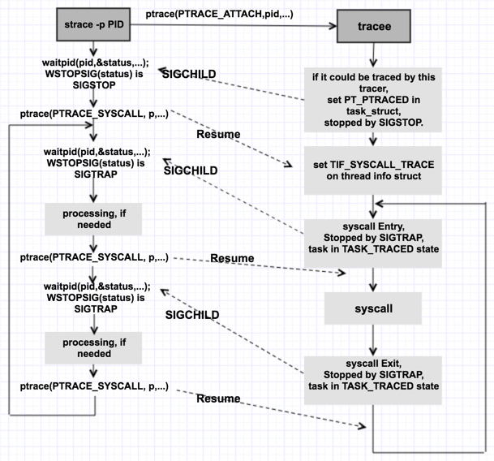

<!-- $theme: gaia -->

<style type="text/css">
  .reveal {font-size: 24pt;}
  .reveal p {
    text-align: left;
  }
  .reveal ul {
    display: block;
  }
  .reveal ol {
    display: block;
  }
  .reveal pre {
    font-size: 0.8em;
  }
  .reveal code {
    white-space: pre-wrap;
    color: #dcdcdc;
    background: #3f3f3f;
    font-size: 0.8em;
  }
  .reveal .slides > section, .reveal .slides > section > section {
    line-height: 1.1;
    font-weight: inherit;
  }
</style>

<style>
body.slide-view .slide_wrapper, body.to-pdf .slide_wrapper {
  font-size: 24pt;
  line-height:1;
}
body.slide-view .slide_wrapper ul > li, body.slide-view .slide_wrapper ol > li, body.to-pdf .slide_wrapper ul > li, body.to-pdf .slide_wrapper ol > li {
    margin: 0.05em 0; }
body.slide-view .slide_wrapper code, body.to-pdf .slide_wrapper code {
  white-space: pre-wrap;
}
/*
body.slide-view .slide_wrapper pre code, body.to-pdf .slide_wrapper pre code {
  padding: 1.5em 0.5em
}
*/
</style>

# How Does Debugger Work
### A glance on ptrace
##### By Yuan Liu

---

<!-- page_number: true -->
<!-- *template: invert -->
## Topics

---

> Focus on lightweight debugger `strace` and trivial userspace debugger like `GDB`.
> The code samples will refer to Linux Kernel 4.6 x86-64. 

---

### What's covered

- how `strace` work
  - system calls tracing 
- how debuggers work
  - single-step debugging
  - breakpoint
  - access/modify debuggee's memory and registers
- practical uses of `ptrace` for debuggers

### What's not covered

- usage of `strace`
- options of `ptrace`
- how debugger figures out where to find the functions and variables in the machine code 
	- ( *it's a compiler issue, the debugging information should be provided by the compilers, and then used by debuggers; for more information, you can refer to* ***DWARF*** )

---

<!-- *template: invert -->
## Introduction

---

### Terms

- tracer - tracee
- debugger - debuggee

### strace


`strace` is a diagnostic, debugging and instructional **userspace utility** for Linux. It is used to monitor and tamper with **interactions between processes and the Linux kernel**, which include **system calls**, signal deliveries, and changes of process state.

This slide only talks about how `strace` traces the system calls. 

---

### debugger


A debugger can start some process and debug it, or attach itself to an existing process. 

It can **single-step** through the code, set **breakpoints** and run to them, examine variable values and stack traces. 

Many debuggers have advanced features such as executing expressions and calling functions in the debugged process's address space, and even **changing the process's code on-the-fly** and watching the effects. 

---

### ptrace

`ptrace` is a system call which a program can use to: 

- read and write the tracee's memory and registers
- be notified of system events ( recognize `exec` syscall, `clone` , `exit` and all the other syscalls )
- control the tracee's execution
- manipulate signal delivery to the traced process

`ptrace` is used by `strace` , GDB and other tools as well. 

---

<!-- *template: invert -->
## Basic ideas

---

## Fundamentals

nearly all about 3 interrupts, will talk them latter. 

- `int 1h` , hardware breakpoint, aka. *trap*
- `int 3h` , software breakpoint, aka. `0xCC` 
- `int 80h` , system call

---

## Basic ideas for ptrace

`ptrace` works this way: 

- the tracee asks the OS kernel to let its parent trace it 
- ( or vice-versa, the tracer asks the OS kernel to help it trace the tracee )
- then flags are set,which are used for judgement
- when some conditions are satisfied, the tracee is stopped, and the tracer can access the code and data of the tracee

We can take *syscall tracing* as an example

---

### Basic ideas - syscall tracing - arises from attach

- The tracer can use the `PTRACE_ATTACH` flag when calling `ptrace` and supply the pid of the tracee: 
```C
ptrace(PTRACE_ATTACH, target_pid, 0, 0);
```
- After that, the tracee is stoped. 
- This is followed by another call to `ptrace` with the `PTRACE_SYSCALL` flag: 
```C
ptrace(PTRACE_SYSCALL, target_pid, 0, 0);
``` 
- The tracee will run until it enters a system call, at which point it will be stopped by the Linux kernel.

---

### Basic ideas - syscall tracing

- The tracer will appear as if the tracee has been stopped because it received a `SIGTRAP` signal (via `wait()`).
- Then the tracer can inspect the args to the system call, print any relevant information. 
- Then, the tracer can call `ptrace` with `PTRACE_SYSCALL` again which will resume the tracee, but cause it to be stopped by the kernel when it exits the system call.

The pattern above continues to trace the entry and exit from system calls allowing the tracer to inspect the tracee and print arguments, return values, timing information, and more.

---

<!-- *template:invert -->
## Code insight
#### Talk is cheap, show me the code.

---

### ptrace

A good place to start looking is the code in the kernel for the `ptrace` system call. 

The code samples below will refer to the Linux Kernel 4.6, the arch-specific part will refer to x86. 

In kernel/ptrace.c#L1078, `ptrace` definition:

```c
SYSCALL_DEFINE4(ptrace, long, request, long, pid, unsigned long, addr, unsigned long, data)
```

We can start by understanding what `PTRACE_ATTACH` does.

---

#### PTRACE_ATTACH

kernel/ptrace.c#L1097, statements checking the request parameter for `PTRACE_ATTACH` . 

`ptrace_attach()` is called. 

```C
if (request == PTRACE_ATTACH || request == PTRACE_SEIZE) {
	ret = ptrace_attach(child, request, addr, data);
	/*
	 * Some architectures need to do book-keeping after
	 * a ptrace attach.
	 */
	if (!ret)
		arch_ptrace_attach(child);
	goto out_put_task_struct;
}
```

---

`ptrace_attach()` is at L295 in the same file, it does a few things early on: 
- sets flags which will be stored on a structure in the kernel representing the process that is being attached to, L303~L311
- ensures that the task is not a kernel thread, L316
- ensures that the task is not a thread of the current process, L318
- calls `__ptrace_may_access()` to do some security checks, L331

Then, flags are set, L349: `task->ptrace = flags;`, here `flags = PT_PTRACED`. 
And, the process is stopped, L355: `send_sig_info(SIGSTOP, SEND_SIG_FORCED, task);` . 
Then `ptrace_attach()` returns, and `ptrace()` finishes ( L1105, `goto out_put_task_struct; `)

`arch_ptrace_attach()` is Macro that does nothing. 

---

#### PTRACE_SYSCALL

In this case, `ptrace` checks if the process is ready for ptrace operations by calling `ptrace_check_attach()`, L1108: 
```C
ret = ptrace_check_attach(child, request == PTRACE_KILL || request == PTRACE_INTERRUPT);
```

Then `ptrace` calls `arch_ptrace()` which is a function supplied by the CPU architecture specific code, L1113: 
```C
ret = arch_ptrace(child, request, addr, data);
``` 

For us, `arch_ptrace()` is the x86 `ptrace` code, which can be found in arch/x86/kernel/ptrace.c#L798. 

---

#### arch_ptrace

x86's `arch_ptrace()` contains a long switch-case list, but it has nothing to do for `PTRACE_SYSCALL`. 

Thereby the default case is hit, arch/x86/kernel/ptrace.c#L908: 
```C
ret = ptrace_request(child, request, addr, data);
``` 

the function hands execution back up to `ptrace_request()` , kernel/ptrace.c#L840. 

#### ptrace_request

There are also a long switch-case list, and at L1019, we can find `case PTRACE_SYSCALL:` and then `ptrace_resume()` is called at L1021: 
```C
return ptrace_resume(child, request, data);
```

---

#### ptrace_resume()

It starts by setting the `TIF_SYSCALL_TRACE` flag on the thread info structure for the tracee, L745: 

```C
if (request == PTRACE_SYSCALL)
	set_tsk_thread_flag(child, TIF_SYSCALL_TRACE);
```

A few possible states are checked ( L757~L767, as other functions might call `ptrace_resume()` ) and finally the tracee is woken up and execution resumes until the tracee enters a system call, L786: 

```C
wake_up_state(child, __TASK_TRACED);
```

---

### Entering system calls

we know that the flag `TIF_SYSCALL_TRACE` is set in tracee, then when is the flag TIF_SYSCALL_TRACE checked and acted upon?

whenever a system call is made by a program, there is CPU architecture specific code that is executed on the kernel side prior to the execution of the system call itself.

The code that is executed on x86 CPUs when a system call is made is written in assmebly and can be found in arch/x86/entry/entry_64.S#L141. 

---

#### _TIF_WORK_SYSCALL_ENTRY

In the assembly function `ENTRY(entry_SYSCALL_64)` , we can see the flag is checked here, L182: 

```x86asm
testl $TIF_WORK_SYSCALL_ENTRY|TIF_ALLWORK_MASK, ASM_THREAD_INFO(TI_flags, %rsp, SIZEOF_PTREGS)
jnz	entry_SYSCALL64_slow_path
```

The definition of `_TIF_WORK_SYSCALL_ENTRY` is shown here, arch/x86/include/asm/thread_info.h#L141:

```x86asm
#define _TIF_WORK_SYSCALL_ENTRY	\
	(_TIF_SYSCALL_TRACE | _TIF_SYSCALL_EMU | _TIF_SYSCALL_AUDIT |	\
	 _TIF_SECCOMP | _TIF_SYSCALL_TRACEPOINT |	\
	 _TIF_NOHZ)
```

If this flag is set, execution moves to `entry_SYSCALL64_slow_path` .  In `entry_SYSCALL64_slow_path` , `do_syscall_64` ( arch/x86/entry/common.c, L333 ) is called. 

---

#### _TIF_WORK_SYSCALL_ENTRY

In short, on every system call made, the thread info structure for a process has its flags checked for `_TIF_SYSCALL_TRACE` .

If a flag is set, execution moves to `do_syscall_64()` .

---

####  do_syscall_64()

In `do_syscall_64()` , `syscall_trace_enter()` is called, L341:

```c
if (READ_ONCE(ti->flags) & _TIF_WORK_SYSCALL_ENTRY)
    nr = syscall_trace_enter(regs);
```

`syscall_trace_enter()` is defined in the CPU specific ptrace code found in arch/x86/entry/common.c#L192. It calls `syscall_trace_enter_phase1()` and `syscall_trace_enter_phase2()` to check if `_TIF_SYSCALL_TRACE` flag is set. If so, `tracehook_report_syscall_entry()` is called, L181: 

```c
if ((ret || test_thread_flag(TIF_SYSCALL_TRACE)) &&
      tracehook_report_syscall_entry(regs))
    ret = -1L;
```

Then `tracehook_report_syscall_entry()` calls `ptrace_report_syscall()`, include/linux/tracehook.h#L103: `return ptrace_report_syscall(regs);` .

---

#### ptrace_report_syscall()

`ptrace_report_syscall()` would report a syscall: 
a `SIGTRAP` is generated when a traced process enters a system call, include/linux/tracehook.h#L66: 
```c
ptrace_notify(SIGTRAP | ((ptrace & PT_TRACESYSGOOD) ? 0x80 : 0));
```

`ptrace_notify()` is implemented in kernel/signal.c#L1913. 

`ptrace_notify()` calls `ptrace_do_notify()` ( L1899, `ptrace_do_notify(SIGTRAP, exit_code, CLD_TRAPPED);` ) which prepares a signal info structure( L1091~L1097 ) for delivery to the process by `ptrace_stop()`, L1777: 
```c
ptrace_stop(exit_code, why, 1, &info);
```

---

### SIGTRAP

Once the tracee receives a `SIGTRAP`, the tracee is stopped and the tracer is notified that a signal is pending for the process. 

The tracer can then examine the state of the tracee and print register values, timestamps, or other information. *details will be explains in the debugger part.* 

This is how `strace` prints its information to the terminal when you trace a process. 

---

### syscall_trace_leave()

A similar code path is executed for the exit path of the system call:

- `syscall_return_slowpath()` is called by `do_syscall_64()`
- `syscall_slow_exit_work()` is called by `syscall_return_slowpath()` 
- this function calls `tracehook_report_syscall_exit()`
- which also calls `ptrace_report_syscall()`, just like the entry path

And this is how tracing processes are notified when a system call completes. 

So they can harvest the **return value**, **timing information**, or **anything else** needed to print useful output for the user. 


---



---

### More on PT_PTRACED

---

#### PTRACE_TRACEME

another way to set the `ptrace` flag of is  `PTRACE_TRACEME`. 
( `PTRACE_SEIZE` is just like `PTRACE_ATTACH`, but will not stop the tracee ). 

kernel/ptrace.c#L1084, statements checking the request parameter for `PTRACE_ATTACH` ,  `ptrace_traceme()` is called:  

```C
if (request == PTRACE_TRACEME) {
	ret = ptrace_traceme();
	if (!ret)
		arch_ptrace_attach(current);
	goto out;
}
```

---

#### PTRACE_TRACEME

`ptrace_traceme()` is at L409, it does a few things:

- check whether this current process is already being traced, L415
- determine whether another process may trace the `current` , L416
- Check `PF_EXITING` to ensure `real_parent` has not passed `exit_ptrace()` , L422


Then `PT_PTRACED` is set,  `current->ptrace = PT_PTRACED;`, at L423.

And the function returns, `ptrace()` finishes ( L1088, `goto out;` ) 

---

#### PTRACE_TRACEME

you can see the `current` process is not stopped, but: 
- all subsequent calls to `exec()` by this process will cause a `SIGTRAP` to be sent to it
- gives the parent a chance to gain control before the new program begins execution. 

Note:
- A process probably shouldn't make this request if its parent isn't expecting to trace it. 
- child should call `ptrace_traceme()`, then `exec()` the specified program.  

---

#### execve

we can checked this in `sys_execve()`, fs/exec.c#L1806: 

```C
SYSCALL_DEFINE3(execve,
		const char __user *, filename,
		const char __user *const __user *, argv,
		const char __user *const __user *, envp)
{
	return do_execve(getname(filename), argv, envp);
}
```

`sys_execve()` calls `do_execve()`,  then `do_execve()` calls `do_execveat_common()` , L1724.

In the  `do_execveat_commom()` , `exec_binprm()` is called at L1686. 

Finally in `exec_binprm()` , can find `ptrace_event(PTRACE_EVENT_EXEC, old_vpid);` is executed at L1570. 

---

#### ptrace_event

located at include/linux/ptrace.h#L143.
with the event `PTRACE_EVENT_EXEC` and `PT_PTRACED` flag, the tracee would receive a `SIGTRAP` signal, L148~151: 

```c
else if (event == PTRACE_EVENT_EXEC) {
	/* legacy EXEC report via SIGTRAP */
	if ((current->ptrace & (PT_PTRACED|PT_SEIZED)) == PT_PTRACED)
		send_sig(SIGTRAP, current, 0);
}
```

#### PT_PTRACED

Indicates that this process is to be traced by its parent. Any signal (except `SIGKILL` ) delivered to this process will cause it to stop and its parent to be notified via `wait()`. 

---


<!-- *template: invert -->
## About debuggers

---

`ptrace` allow a (debugger) process to access low-level information about another process (the debuggee). 
In particular, the debugger can: 

- read and write the debuggee's memory: `PTRACE_PEEKTEXT`, `PTRACE_PEEKDATA` , `PTRACE_PEEKUSER` , `PTRACE_POKETEXT` , `PTRACE_POKEDATA`  , `PTRACE_POKEUSER` 
- read and write the debuggee's CPU registers: `PTRACE_GETREGSET` , `PTRACE_SETREGS`
- be notified of system events: `PTRACE_O_TRACEEXEC` , `PTRACE_O_TRACECLONE` , `PTRACE_O_EXITKILL` , `PTRACE_SYSCALL`
- control its execution: `PTRACE_SINGLESTEP` , `PTRACE_KILL` , `PTRACE_CONT` 
- alter its signal handling: `PTRACE_GETSIGINFO`, `PTRACE_SETSIGINFO`

things about `PTRACE_SYSCALL` is clearly explained above. the rest will talk about other flags briefly and how debuggers work. 

---

<!-- *template: invert -->
### More on ptrace

---

- how to access CPU registers
	- easy with `copy_regset_to/from_user` . both `PTRACE_GETREGS` and `PTRACE_SETREGS` are handled in `arch_ptrace()` at arch/x86/kernel/ptrace.c#L840 and #L847 with `copy_regset_to_user()` and `copy_regset_from_user()` respectively. 


- how to access debuggee's memory
	- `copy_to/from_user` may work well. Actually with respect to `PTRACE_PEEKDATA` , `PTRACE_PEEKTEXT` and `PTRACE_POKEDATA` , `PTRACE_POKETEXT` ( Linux does not have separate text and data address spaces, so these two requests are currently equivalent )
	- `ptrace_requests` just calls `generic_ptrace_peekdata()` and `generic_ptrace_pokedata()` respectively, which using `access_process_vm()` to read/write the destination address. `access_process_vm()` calls `__access_remote_vm()`, and in `__access_remote_vm()` , `copy_to_user_page` or `copy_from_user_page` is called to write or read the desired data, mm/memory.c#L3768~L3774. 

---

- how to change the signal handling
	- `PTRACE_GETSIGINFO` and `PTRACE_SETSIGINFO`  are handled in`ptrace_request()` by `ptrace_getsiginfo()` and `ptrace_setsiginfo()` respectively. `ptrace_getsiginfo()` just copies the signal from`child->last_siginfo` and `ptrace_setsiginfo()` just updates field `child->last_siginfo` , kernel/ptrace.c#L617 and L633


- how to know system events 
	- `ptrace` is  hooked ( function `ptrace_event()`, include/linux/ptrace.h#L143 ) in many scheduling operations, so that it can send a `SIGTRAP` signal to the debugger if requested ( `PTRACE_O_TRACEEXEC` option and its family ). just like the `PTRACE_EVENT_EXEC` mentioned above. 

---

### single step debugging

Use `ptrace(PTRACE_SINGLESTEP, pid, 0, 0)` for single step debugging. What this does is tell the OS - **restart the child process, but stop it after it executes the next instruction**. 

actually this feature is implemented with the `Trap Flag` and `int 1h` in x86. 

like `PTRACE_SYSCALL` , `PTRACE_SINGLESTEP` is also handled in `ptrace_resume()`, kernel/ptrace.c#L840: 
```C
return ptrace_resume(child, request, data);
```
then `ptrace_resume()` calls `user_enable_single_step(child)` at L764. 

---

### single step debugging

Inside `user_enable_single_step()`, `enable_step(child, 0);` is called at kernel/step.c#L210. Then`enable_step()` calls `enable_single_step(child)` at L204, in which some important flags are set: L131 `set_tsk_thread_flag(child, TIF_SINGLESTEP);` , L136: `regs->flags |= X86_EFLAGS_TF; `, L159: `set_tsk_thread_flag(child, TIF_FORCED_TF);` .

After `user_enable_single_step()` is called, `ptrace_resume()` executes `wake_up_state(child, __TASK_TRACED);` at kernel/ptrace.c#L786, the tracee will be woken up by the scheduler. 

Once the tracee is scheduled to run, the regs is restored, causing TF set, the CPU enters single-step mode. 
What means the system will execute the next instruction and do a `int 1h` interrupt. 

---

### int 1h

in Linux, `int 1h` handler is defined at arch/x86/kernel/traps.c#L607:

```C
dotraplinkage void do_debug(struct pt_regs *regs, long error_code)
```

at L708, `SIGTRAP` is sent to the current task: 
```C
send_sigtrap(tsk, regs, error_code, si_code);
```
at this moment, tracee is stopped, and tracer knows tracee is stopped. 

---

### handle_signal

Also in the `handle_signal()` at arch/x86/kernel/signal.c#L736, the function tests the `TIF_SINGLESTEP` and disables the single step, L736~738

```C
stepping = test_thread_flag(TIF_SINGLESTEP);
if (stepping)
	user_disable_single_step(current);
```

`user_disable_single_step()`  just clear task flag `clear_tsk_thread_flag(child, TIF_SINGLESTEP);` and clear `TRAP FLAG` ( `TIF_FORCED_TF` is used here ), kernel/step.c#L232~233:

 ```C
if (test_and_clear_tsk_thread_flag(child, TIF_FORCED_TF))
	task_pt_regs(child)->flags &= ~X86_EFLAGS_TF;
 ```

All done!

---

### breakpoints

breakpoints are implemented on the CPU by a special trap called `int 3h`.

The `int 3h` instruction generates a special one byte opcode (`0xCC`) that is intended for calling the debug exception handler. 

So how to use it?

---

1. debugger reads (`ptrace` peek) the instruction stored at this address, and backups it.
2. write `0xCC` at this location. 
3. when debuggee reaches this location, `int 3h` is triggered.
4. this interruption causes a `SIGTRAP` sent to debuggee, then the debugger gets noticed.
5. the debugger gets the signal, and checks the debuggee's instruction pointer ( *check whether the `IP` address is in its breakpoint list* ).
6. now that the debuggee is stopped at the breakpoint, the debugger can let its user do what ever s/he wants. 
7. to continue, the debugger needs to:
   1. write the correct instruction back.
   2. unwind the `IP` back by 1.
   3. single-step it. 
   4. write the `0xCC` back. 
   5. let the execution flow normally. 

---

#### as for ptrace

- use `PTRACE_PEEKTEXT` and `PTRACE_POKETEXT` to alter the instruction
- use `PTRACE_GETREGS` and `PTRACE_SETREGS` to access and update `IP` register
- use `PTRACE_CONT` or `PTRACE_SINGLESTEP` to resume the tracee. 

`PTRACE_CONT` is handle by `ptrace_resume()` like `PTRACE_SINGLESTEP`, in this case:

- `TIF_SYSCALL_TRACE` is cleared, L748: 
`clear_tsk_thread_flag(child, TIF_SYSCALL_TRACE);`
- `single_step` is disabled, L766: `user_disable_single_step(child);`
- then the tracee will be woken up by `wake_up_state(child, __TASK_TRACED);`, L786. 

---

#### int 3h

the `int 3h` handler is defined at arch/x86/kernel/traps.c#L468: 

```C
dotraplinkage void notrace do_int3(struct pt_regs *regs, long error_code)
```

we can find the `SIGTRAP` is sent at L506:

```C
do_trap(X86_TRAP_BP, SIGTRAP, "int3", regs, error_code, NULL);
```

---

### conditional breakpoint

conditional breakpoints are **normal breakpoints**, except that: 
- the debugger checks the conditions before giving the control to the user. 
- if the condition is not matched, the execution is silently continued.

---

### watchpoints

watchpoints are implemented (if available) with the help of the processor: 
- write in registers which addresses should be monitored
- it will raise an exception when the memory is read or written

If this support is not available, or if you request more watchpoints than the processor supports, then the debugger falls back to **"hand-made" watchpoints**: 
- single-step the program
- check if the current operation touches a watchpointed address

---

<!-- *template: invert -->
## Demos

---

### strace.c
### singlestep.c
### breakpoint.c

---

## References

- http://man7.org/linux/man-pages/man1/strace.1.html
- http://man7.org/linux/man-pages/man2/ptrace.2.html
- https://github.com/torvalds/linux/tree/v4.6
- https://blog.nelhage.com/2010/08/write-yourself-an-strace-in-70-lines-of-code/
- https://blog.0x972.info/?d=2014/11/13/10/40/50-how-does-a-debugger-work

---

<!-- *template: gaia -->
## Thanks!